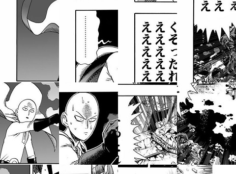

# OPM_tonarinoyj_webscrapper

One Punch Man is a popular japanese manga written by the manga artist "ONE" and illustrated by Yusuke Murata. The manga gets new chapters bi-weekly and can be read for free on the official webseite [Tonarinoyj](https://tonarinoyj.jp/episode/13932016480028985383).

The goal of this project is to create a webscrapper in python to download the japanese One Punch Man chapters from the official website. After some research it became evident, that the manga pages are cut into smaller patches. Additionally, these patches got a randomized order. The below image shows a subsection of manga page:

The easiest solution for this task would be to just take a screenshot of the displayed manga page. But the purpose of this project isn't to just download the manga chapters, but rather to get more practice in webscrapping and to explore how the images can be reconstructed from this randomized state.
